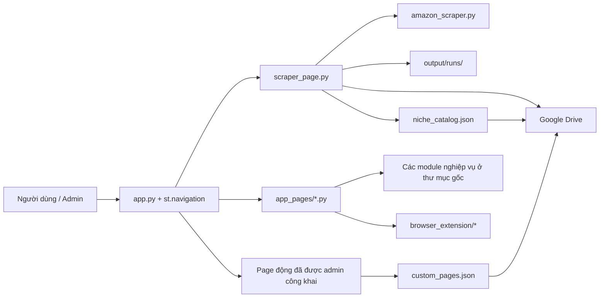

# Hướng dẫn tiếp quản dự án RinBoss Commerce

Tài liệu này là điểm bắt đầu cho AI agent hoặc lập trình viên mới làm việc với repository. Hãy đọc toàn bộ file trước khi sửa code. README dành cho người sử dụng; file này tập trung vào kiến trúc, các bất biến cần giữ và quy trình phát triển an toàn.

## 1. Mục tiêu và trạng thái hiện tại

RinBoss Commerce là ứng dụng Streamlit tiếng Việt dùng để:

- thu thập và quản lý kết quả tìm kiếm sản phẩm Amazon;
- lưu kết quả từng ngách, tổng hợp phiên chạy và đồng bộ Google Drive;
- quản lý người dùng, quota, ngách đã duyệt, category và page dữ liệu tùy chỉnh;
- chuẩn bị file Excel cho TikTok Shop US;
- nhập/so sánh dữ liệu Temu US và Amazon;
- quản lý đơn Temu US qua Open API;
- cung cấp các Chrome extension để thu thập dữ liệu trong trình duyệt người dùng;
- bổ sung gallery ảnh và tải hàng loạt ảnh theo tên thành file ZIP.

Ứng dụng thử nghiệm đang được triển khai tại:

- URL: <https://rinboss112-demo.streamlit.app/>
- repository: <https://github.com/rinboss112-debug/rinboss112>
- branch thử nghiệm: `dev`
- branch ổn định: `main`

Quy ước quan trọng: mọi thay đổi mới phải làm và kiểm tra trên `dev`. Chỉ cập nhật hoặc merge sang `main` khi chủ dự án yêu cầu rõ ràng. Không tự suy diễn rằng một tính năng đã kiểm tra trên `dev` thì được phép đưa lên `main`.

## 2. Khởi động nhanh

```powershell
python -m venv .venv
.\.venv\Scripts\Activate.ps1
python -m pip install --upgrade pip
python -m pip install -r requirements.txt
python -m streamlit run app.py
```

Chạy kiểm tra trước khi commit:

```powershell
python -m pytest -q
python -m py_compile app.py amazon_scraper.py
git diff --check
```

Nếu chỉ sửa một module, hãy chạy test liên quan trước, sau đó vẫn chạy toàn bộ test suite trước khi push.

## 3. Kiến trúc tổng quát



Streamlit chạy lại script khi widget thay đổi. `app.py` là entry point duy nhất của web app, khởi tạo điều hướng rồi gọi `navigation.run()`. Các file trong `app_pages/` là phần giao diện; logic có thể kiểm thử nằm trong các module ở thư mục gốc.

### Các file quan trọng

| File/thư mục | Trách nhiệm |
|---|---|
| `app.py` | Cấu hình trang, khai báo route tĩnh, tải page/category động và chạy `st.navigation`. |
| `scraper_page.py` | Giao diện cào Amazon, session state, worker nền, log/progress, lọc kết quả, lịch sử, ZIP và đồng bộ Drive. |
| `amazon_scraper.py` | HTTP session Amazon, đặt ZIP, đọc thẻ kết quả, chuẩn hóa dữ liệu, lưu CSV từng ngách và CLI. |
| `app_pages/` | Giao diện các trang quản trị, extension, TikTok, Temu, so sánh và ảnh. |
| `cloud_storage.py` | OAuth Google Drive và thao tác thư mục/file. |
| `access_control.py` | Thành viên, mã truy cập băm, quota và công tắc cho phép cào. |
| `niche_catalog.py` | Danh mục ngách chờ duyệt/công khai. |
| `custom_pages.py` | Category, page tùy chỉnh và bảng dữ liệu có thể sửa. |
| `custom_page_view.py` | Hiển thị page dữ liệu công khai. |
| `tiktok_export.py` | Chuẩn hóa sản phẩm, tính giá, kiểm tra dữ liệu và điền template TikTok XLSX. |
| `temu_orders.py` | Ký request, gọi Temu Open API, chuẩn hóa đơn, deadline, label và ghi chú. |
| `temu_hot_products.py` | Tạo link ngách Temu, nhập/lọc/chấm điểm dữ liệu sản phẩm Temu. |
| `marketplace_gap.py` | Chuẩn hóa và so sánh file Temu/Amazon do extension xuất. |
| `amazon_extension_import.py` | Đọc CSV do Amazon Collector xuất. |
| `amazon_image_enricher.py` | Lấy tối đa 5 ảnh gallery từ trang chi tiết Amazon bằng request phía server. |
| `image_batch_downloader.py` | Tải ảnh công khai theo tên, kiểm tra định dạng/an toàn URL và tạo ZIP kèm báo cáo. |
| `notifications.py` | Thông báo hoàn tất qua Telegram/email. |
| `browser_extension/` | Ba Chrome extension độc lập: Amazon Collector, Marketplace Collector và Product Image Collector. |
| `tests/` | Unit test và Streamlit AppTest cho các luồng chính. |

## 4. Route và quyền truy cập

| Route | Chức năng | Quyền hiện tại |
|---|---|---|
| `/` | Cào và quản lý kết quả Amazon | Mật khẩu app hoặc mã thành viên khi access control bật |
| `/amazon-extension` | Tải Amazon Collector | Công khai trong menu |
| `/marketplace-extension` | Tải Marketplace Collector | Công khai trong menu |
| `/image-extension` | Tải Product Image Collector | Công khai trong menu |
| `/download-images` | Dán/upload tên và link ảnh, tạo ZIP | Admin |
| `/tiktok-shop-us` | Chuẩn bị và xuất XLSX TikTok Shop US | Admin |
| `/amazon-images` | Bổ sung gallery ảnh Amazon từ CSV | Admin |
| `/temu-hot-products` | Tạo link ngách và phân tích dữ liệu Temu | Admin |
| `/temu-amazon-gap` | So sánh dữ liệu Temu/Amazon | Admin |
| `/temu-orders` | Quản lý đơn Temu Open API | Admin |
| `/admin` | Thành viên, quota, duyệt ngách và page tùy chỉnh | Admin, route ẩn |

`app.py` còn tạo route động từ `custom_pages.json`. Chỉ page có `published=true` mới xuất hiện trên menu, được nhóm theo category và dùng `slug` làm URL.

Các trang admin dùng chung `st.session_state["admin_authenticated"]`. Mật khẩu thật chỉ lấy từ `st.secrets["admin"]["password"]`; không đưa mật khẩu vào code, log, test fixture đã commit hoặc URL.

## 5. Luồng cào Amazon

### Luồng một phiên chạy

1. `scraper_page.py` gom và loại trùng danh sách ngách từ TXT/textarea.
2. Tạo `RunConfig`, `run_id` và thư mục `output/runs/<run_id>/`.
3. `_start_job()` tạo một daemon thread với `RunController`; UI chỉ đọc snapshot có khóa.
4. `_run_job()` gọi `scrape_keywords()` và truyền callback log, progress, result và stop.
5. `scrape_keywords()` chạy tuần tự từng ngách. Sau mỗi ngách thành công, nó lưu CSV riêng và cập nhật file tổng hợp ngay lập tức.
6. Callback kết quả cập nhật UI và tải CSV của ngách/file gộp lên Drive nếu Drive đã cấu hình.
7. Cuối phiên tạo `manifest.json`, `errors.log` nếu có, file ZIP, cập nhật danh mục chờ admin duyệt và gửi thông báo tùy chọn.
8. Nút dừng chỉ có hiệu lực sau khi ngách hiện tại kết thúc; không hủy request giữa chừng.

### Schema sản phẩm và thứ tự CSV

`Product` trong `amazon_scraper.py` là schema nguồn:

```text
title, image_url, price, variants, delivery_detail, keyword, asin,
product_url, currency, rating, review_count, prime, free_shipping,
fast_shipping, delivery_available, delivery_options, sponsored, scraped_at
```

CSV công khai cố ý sắp đầu file theo thứ tự:

```text
title, image_url, price, variants, delivery_options, ...
```

`delivery_detail` là dữ liệu nội bộ để phân loại/lọc và không được xuất trong `CSV_COLUMNS`. Không đổi schema hoặc thứ tự cột nếu chưa cập nhật đồng thời UI, exporter và test.

### Các bất biến phải giữ

- Link sản phẩm phải chuẩn hóa thành `https://www.amazon.com/dp/<ASIN>`.
- Link ảnh Amazon phải bỏ hậu tố resize như `._AC_UL320_`.
- Scraper đang ở chế độ thu thập rộng: giá, USD, Prime/Fresh và giao hàng được lọc khi xem hoặc tải; không được lén chuyển các bộ lọc UI thành điều kiện loại trong `_extract_product()`.
- Ngoại lệ cố ý: luôn loại sản phẩm thuộc Amazon, Amazon Fresh, Amazon Saver, Amazon Grocery và nhóm 365 được khai báo trong `EXCLUDED_AMAZON_BRAND_PREFIXES`.
- Biến thể hiện được suy luận từ tiêu đề khi `include_variants=True`; scraper không mở trang chi tiết cho mỗi sản phẩm.
- Thông tin giao hàng được đọc từ từng thẻ kết quả Amazon và giữ nguyên câu đang hiển thị trong `delivery_options`. Không thay nó bằng text biến thể, SNAP hoặc text của thẻ bên cạnh.
- Thiếu giá hoặc thiếu ship không phải lý do tự động loại sản phẩm trong tầng scraper.
- Một ngách lỗi không được làm mất CSV đã lưu của ngách trước.
- `PermissionError` khi Excel đang mở CSV phải chuyển sang tên có timestamp, không làm crash phiên.
- `AmazonAccessError` biểu thị Amazon trả trang chặn/rỗng/429/503. Khi xảy ra, dừng các ngách còn lại để tránh tạo hàng loạt file rỗng.
- `amazon_scraper.py` chỉ chạy CLI trong `if __name__ == "__main__":`; import từ Streamlit không được tự chạy CLI.
- Mọi lời gọi `scrape_keyword()` phải truyền `zip_code`.

### Giới hạn cần giải thích đúng cho người dùng

Streamlit Cloud dùng IP máy chủ dùng chung, không dùng Chrome/cookie/IP của máy người dùng. Amazon có thể trả 429, 503, Robot Check hoặc HTML rỗng dù trình duyệt cá nhân vẫn thấy sản phẩm. Xóa cache Streamlit không đổi IP. Không thêm cơ chế vượt CAPTCHA hoặc né chặn. Hướng ổn định hơn là extension chạy trong trình duyệt người dùng hoặc API chính thức khi có quyền.

Ngày giao phụ thuộc ZIP, thời điểm, phiên và thành viên Amazon. Kết quả là ảnh chụp tại thời điểm cào, không phải cam kết giao hàng.

## 6. Lưu trữ và Google Drive

### Dữ liệu local

```text
output/
├── access_control.json
├── niche_catalog.json
├── custom_pages.json
├── temu_order_notes.json
└── runs/
    └── <run_id>/
        ├── <niche>.csv
        ├── <first_niche>_all_products.csv
        ├── errors.log                 # chỉ có khi lỗi
        ├── manifest.json
        └── <first_niche>_<run_id>.zip
```

File trong `output/` bị Git bỏ qua, ngoại trừ `.gitkeep`. Không dùng Git để lưu dữ liệu người dùng.

### Nguồn dữ liệu bền vững

Filesystem của Streamlit Community Cloud không bền vững sau reboot/redeploy. Khi `[google_drive]` hợp lệ, Google Drive là nguồn lưu trữ bền vững cho kết quả phiên và các JSON quản trị. Các store ưu tiên đồng bộ Drive nhưng vẫn có fallback local để app tiếp tục hoạt động khi Drive lỗi.

Khi sửa cơ chế lưu:

- giữ thao tác ghi theo kiểu an toàn và không làm mất bản cũ nếu upload lỗi;
- không chờ hết toàn bộ danh sách mới lưu CSV ngách;
- không đưa token OAuth hoặc nội dung Secrets vào manifest/log;
- giữ tên JSON tương thích để bản deploy cũ vẫn đọc được.

## 7. Các extension

Ba extension là các sản phẩm độc lập và có manifest riêng:

- `browser_extension/amazon_product_collector/`: nhập TXT nhiều ngách, tìm kiếm Amazon, lọc giá và xuất CSV.
- `browser_extension/marketplace_collector/`: thu thập Temu US và Amazon để so sánh giá.
- `browser_extension/product_image_collector/`: nhập CSV, mở link sản phẩm và bổ sung `image_url_1...image_url_10`.

Extension chạy trong Chrome của người dùng nên có thể thấy giao diện/phiên khác với request phía Streamlit Cloud. Không thu thập cookie, mật khẩu hoặc token; không giải CAPTCHA. Khi sửa extension phải tăng version trong `manifest.json` và kiểm tra lại file ZIP do trang Streamlit cung cấp.

## 8. TikTok, Temu và tải ảnh

### TikTok Shop US

Giá đề xuất mặc định dùng công thức:

```text
(giá gốc × 2 + 12) ÷ 0.8
```

Người dùng được sửa giá cuối cùng. Template thay đổi theo category, vì vậy `fill_official_template()` phải giữ cấu trúc/sheet/cột của template do TikTok cung cấp. Không tự khẳng định file chắc chắn được TikTok chấp nhận nếu chưa kiểm tra bằng template hiện hành.

### Temu Open API

Client cần đủ `app_key`, `app_secret`, `access_token` và chữ ký MD5. Không dùng email/mật khẩu Seller Center. Chỉ nút kiểm tra/tải đơn mới gọi API để tránh tốn quota. Label chỉ có khi Temu đã tạo kiện và app có đúng quyền fulfillment.

### Tải ảnh theo tên

`/download-images` nhận hai cột tên/link từ bảng dán trực tiếp hoặc CSV/XLSX rồi gọi `build_named_image_archive()`.

Các giới hạn an toàn hiện tại:

- tối đa 200 ảnh/lượt;
- tối đa 15 MB/ảnh và 250 MB/tổng;
- chỉ HTTP/HTTPS công khai, chặn localhost/mạng riêng và kiểm tra lại mỗi redirect;
- chỉ nhận JPG, PNG, WebP, GIF và AVIF dựa trên nội dung thật;
- thay ký tự Windows cấm bằng `_`, tên trùng thêm `_2`, `_3`;
- ZIP luôn kèm `_download_report.csv` và chống CSV formula injection.

Web không được phép tự ghi vào thư mục tùy ý trên máy người dùng. Luồng đúng là tạo ZIP ở server, sau đó người dùng nhấn tải xuống.

## 9. Secrets và bảo mật

File mẫu là `.streamlit/secrets.example.toml`. Secrets thật chỉ đặt tại:

- `.streamlit/secrets.toml` khi chạy local; hoặc
- Streamlit Cloud → Manage app → Settings → Secrets.

Các section được hỗ trợ:

```toml
[app]          # mật khẩu app cũ/tùy chọn
[admin]        # mật khẩu admin + enable_access_control
[google_drive] # OAuth client_id/client_secret/refresh_token
[temu]         # app_key/app_secret/access_token/endpoint/timezone
[telegram]     # bot_token/chat_id
[email]        # SMTP
```

Không bao giờ commit: `.streamlit/secrets.toml`, `drive_secrets.toml`, `client_secret*.json`, `token*.json`, cookie, browser profile, mật khẩu, access token hoặc refresh token. Trước khi push, kiểm tra `git diff --cached` để chắc chắn không có secret.

Mã truy cập thành viên được lưu dạng hash có salt trong `access_control.json`; không đổi sang lưu plaintext. Mọi tính năng nhận URL từ người dùng và gọi từ server phải có kiểm tra SSRF tương đương `image_batch_downloader.py`.

## 10. Quy tắc sửa Streamlit

- Dùng `app.py` làm entry point và `app_pages/` cho page UI; không tạo thư mục legacy `pages/`.
- Business logic có thể kiểm thử phải nằm ở module gốc, không nhồi request/parsing phức tạp vào page.
- Page là script Streamlit trực tiếp; không thêm `if __name__ == "__main__"` vào page.
- Dữ liệu theo người dùng dùng `st.session_state`; resource dùng chung mới dùng cache phù hợp.
- Giữ key widget ổn định khi UI cần tồn tại qua rerun.
- Không dùng `use_container_width`; với Streamlit hiện tại dùng `width="stretch"` hoặc `width="content"`.
- Ưu tiên widget native và Material Symbols. Theme chung nằm ở `.streamlit/config.toml`.
- Khi thêm route tĩnh: tạo file trong `app_pages/`, khai báo `st.Page` trong `app.py`, thêm route vào bảng ở tài liệu này và cập nhật README.
- Tính năng admin phải gọi kiểm tra mật khẩu trước khi đọc/ghi dữ liệu nhạy cảm.

## 11. Quy trình thay đổi an toàn

1. Xác nhận đang ở branch `dev` và xem `git status` trước khi sửa.
2. Đọc module, page và test liên quan. Không ghi đè thay đổi chưa commit của người dùng.
3. Viết hoặc cập nhật test cho logic nghiệp vụ trước khi coi tính năng hoàn tất.
4. Chạy test mục tiêu, toàn bộ pytest, `py_compile` cho entry point/scraper và `git diff --check`.
5. Nếu thay UI, chạy Streamlit local hoặc dùng `streamlit.testing.v1.AppTest` để xác nhận page render.
6. Commit nhỏ, tên rõ ràng, không chứa output hoặc secrets.
7. Push lên `origin/dev` khi chủ dự án yêu cầu đưa bản thử nghiệm lên Cloud.
8. Xác nhận URL thật sau deploy. Streamlit Cloud có thể cần một lúc để lấy commit mới.
9. Không merge/rebase/push `main` nếu chưa có câu lệnh rõ ràng từ chủ dự án.

Lệnh kiểm tra Git thường dùng:

```powershell
git branch --show-current
git status --short
git diff --check
git diff --cached
git log -1 --oneline
```

## 12. Checklist trước khi bàn giao

- [ ] Chức năng mới có route/menu đúng và quyền truy cập đúng.
- [ ] Không làm thay đổi bất biến của scraper hoặc schema CSV ngoài yêu cầu.
- [ ] Kết quả từng ngách vẫn được lưu ngay.
- [ ] Lỗi Amazon/Drive/Temu được hiển thị rõ nhưng không làm mất dữ liệu trước đó.
- [ ] Không có secret, output hoặc file người dùng trong commit.
- [ ] Test mới và test cũ đều qua.
- [ ] `app.py` và `amazon_scraper.py` compile được.
- [ ] README và `AGENTS.md` đã cập nhật nếu có route, secret, module hoặc workflow mới.
- [ ] Commit nằm trên `dev`; `main` chưa đổi nếu chưa được yêu cầu.

## 13. Những việc nên kiểm tra đầu tiên khi có lỗi

| Triệu chứng | Kiểm tra trước |
|---|---|
| Amazon trả 0 sản phẩm ở mọi ngách | Log chẩn đoán HTTP/title/ASIN; tìm 429, 503, Robot Check hoặc trang rỗng trước khi sửa selector. |
| Trình duyệt có ship nhưng Cloud không có | Khác IP/cookie/ZIP/thời điểm; xác nhận HTML Cloud thật sự có đoạn ship trước khi thay parser. |
| Giá lọc 1–9 nhưng bảng có giá 22 | Kiểm tra đang xem dữ liệu gốc hay dữ liệu đã lọc; bộ lọc phải áp dụng ở view/download. |
| File biến thể xuất hiện trong cột ship | Kiểm tra selector giao hàng chỉ giới hạn trong đúng product card; không dùng toàn bộ card text khi chưa cắt vùng. |
| Drive mất dữ liệu sau reboot | Kiểm tra `[google_drive]`, refresh token và log upload; local Cloud không bền vững. |
| Page mới báo không tồn tại | Kiểm tra `url_path`, branch Cloud đang deploy và commit đã có trên `origin/dev`. |
| Ảnh không tải được | Kiểm tra URL công khai, định dạng thật, redirect, giới hạn dung lượng và `_download_report.csv`. |
| Template TikTok lỗi stylesheet | Dùng luồng sửa XML/style hiện có trong `tiktok_export.py`; giữ nguyên workbook template gốc càng nhiều càng tốt. |

Khi chưa chắc nguyên nhân, ưu tiên thêm chẩn đoán và fixture/test tái hiện lỗi. Không nới bộ lọc hoặc đổi parser dựa trên một ảnh chụp nếu chưa xác nhận HTML đầu vào mà code thực sự nhận được.
